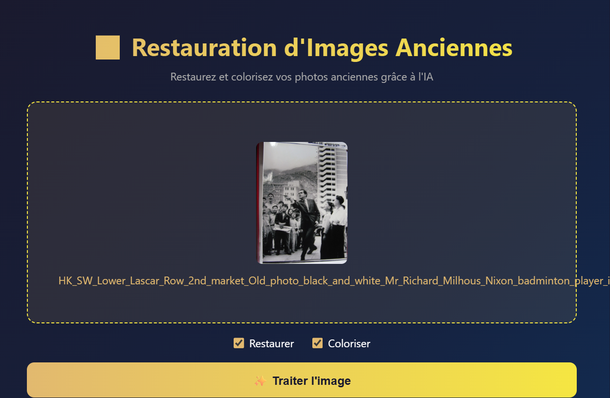
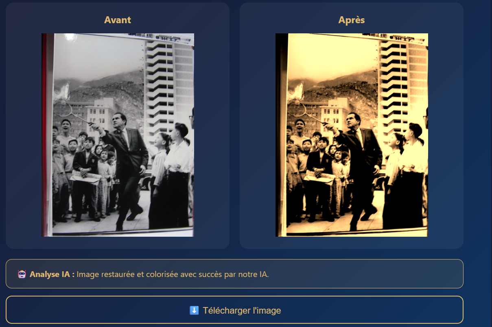

# 🖼️ Restauration et Colorisation d'Images Anciennes

Application web qui restaure et colorise automatiquement les photos anciennes grâce à l'Intelligence Artificielle.

## 🎥 Démonstration

> Démo vidéo à ajouter

## 📸 Captures d'écran

### Interface principale


### Résultat avant/après


## 🚀 Technologies utilisées

- **Backend** : Python, FastAPI
- **Frontend** : HTML, CSS, JavaScript
- **Modèle génératif IA** : ViT-GPT2 (Hugging Face Transformers) — génération automatique de description d'image
- **Traitement image** : Pillow (restauration + colorisation)

## 🤖 Modèle IA utilisé

Le modèle **nlpconnect/vit-gpt2-image-captioning** (Vision Transformer + GPT2) est un modèle génératif qui analyse et décrit automatiquement le contenu des images anciennes.

## ⚙️ Installation et lancement

### Prérequis
- Python 3.14+
- Compte Hugging Face (gratuit)

### Installation

```bash
git clone https://github.com/belhajhajer03-beep/restauration-images.git
cd restauration-images
python -m venv venv
venv\Scripts\activate
pip install fastapi uvicorn pillow python-dotenv httpx python-multipart
```

### Configuration
Créer un fichier `backend/.env` :
### Lancement
```bash
cd backend
uvicorn main:app --reload
```
Ouvrir `frontend/index.html` dans le navigateur.

## 📋 Fonctionnalités

- ✅ Upload d'image par clic ou glisser-déposer
- ✅ Restauration automatique (réduction du bruit, amélioration netteté)
- ✅ Colorisation automatique
- ✅ Analyse IA de l'image
- ✅ Comparaison avant/après
- ✅ Téléchargement de l'image traitée

## 👤 Auteur

**belhajhajer03-beep**